# 3D Print Stuff

Personal stuff that I use for 3d printing

## OpenSCAD models

<a href="scads/clothes_hanging_ring.scad">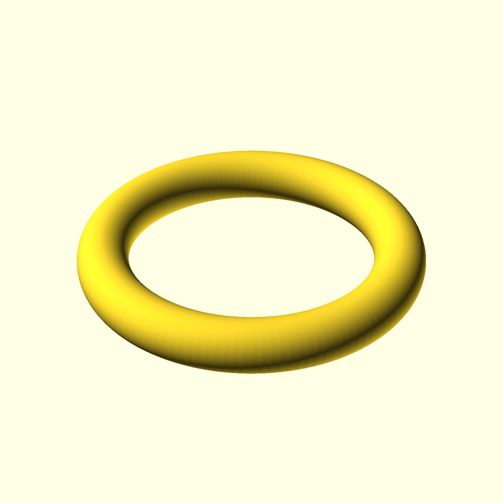</a>

<a href="scads/draw_support.scad">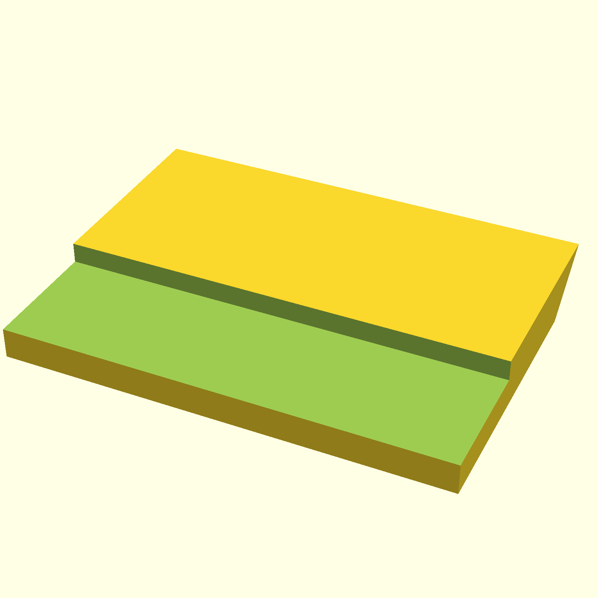</a>

<a href="scads/faucet_holder.scad">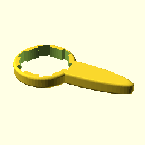</a>
<a href="scads/kvm_support.scad">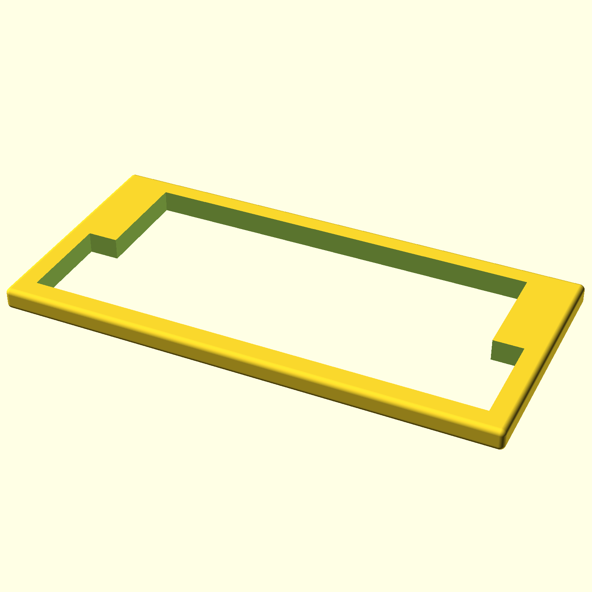</a>
<a href="scads/laptop_standing_battery_support.scad">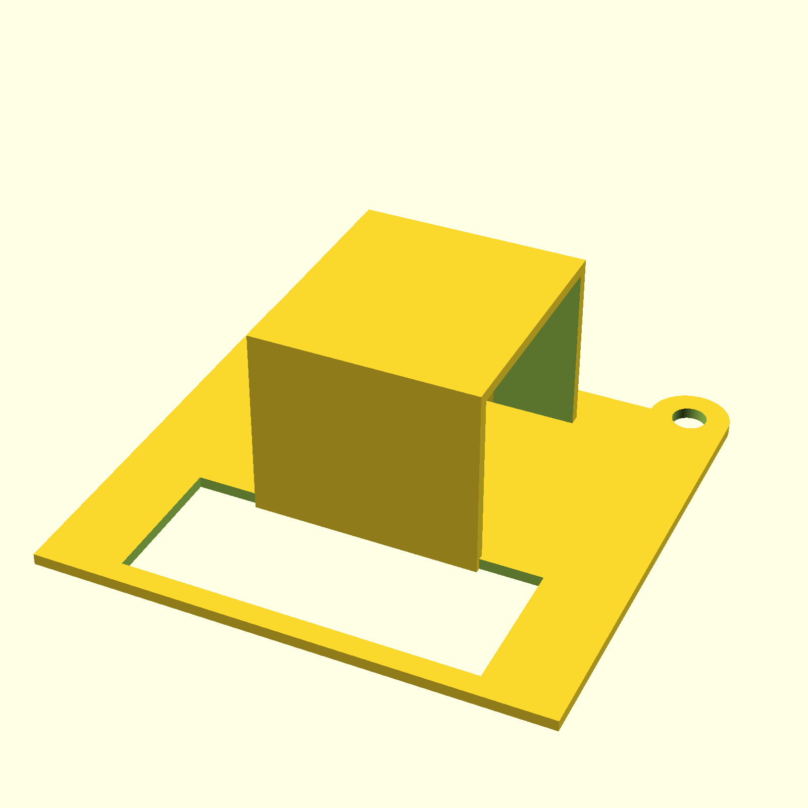</a>
<a href="scads/medicine_cap.scad">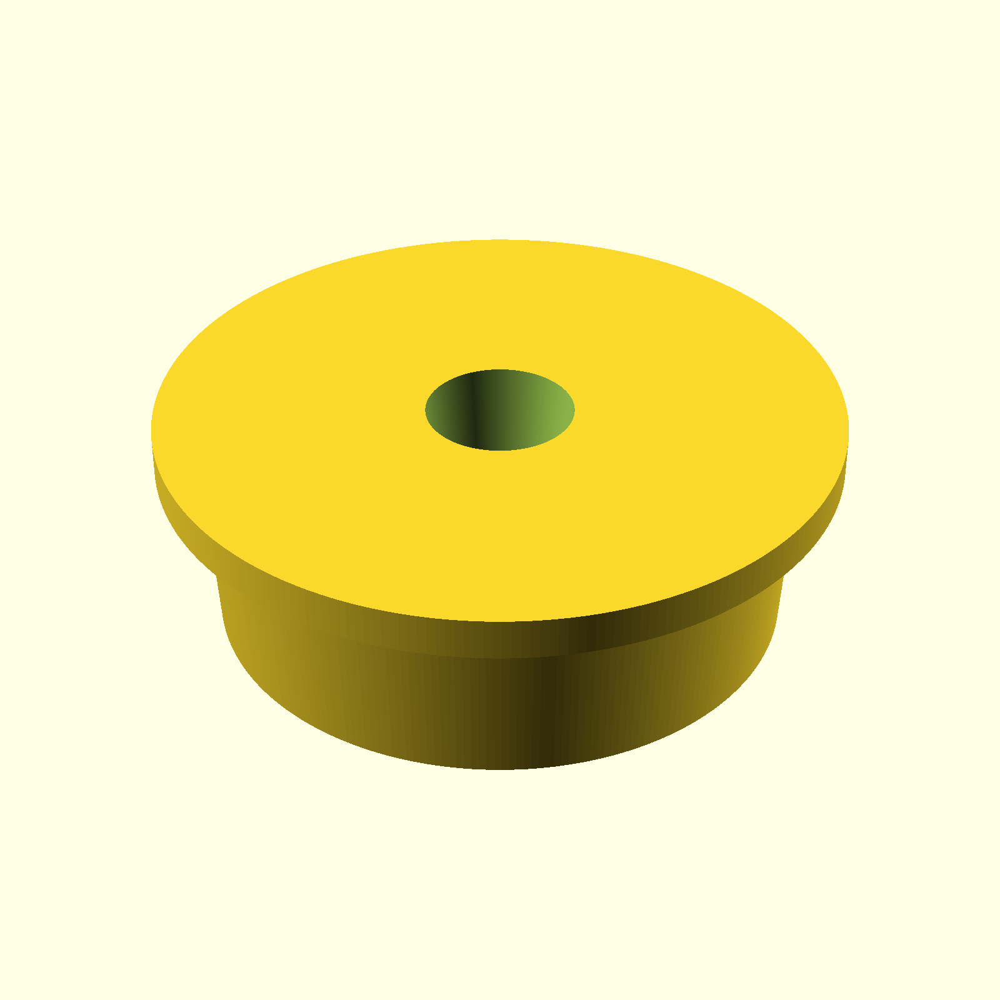</a>

<a href="scads/quest_controller_support.scad">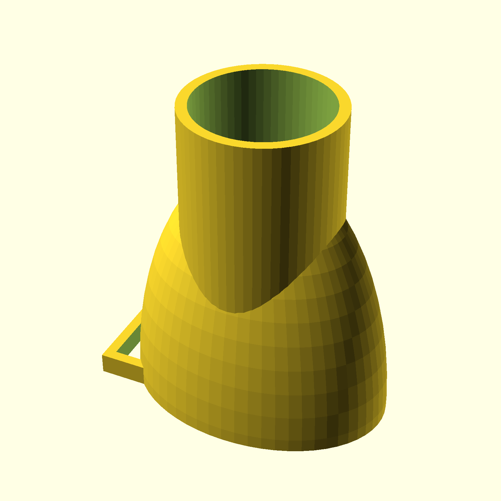</a>
<a href="scads/sift_wheat_holder_fix.scad">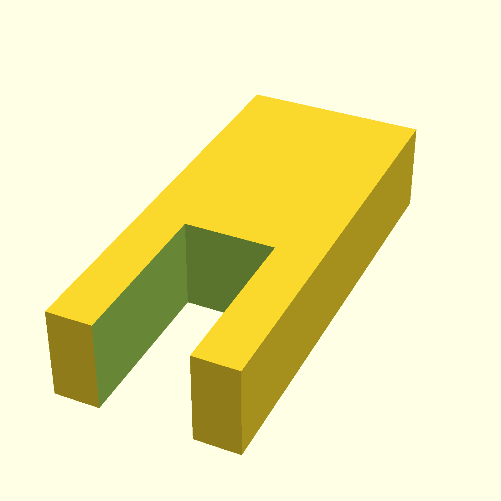</a>
<a href="scads/ubuntu_cable_jointer.scad">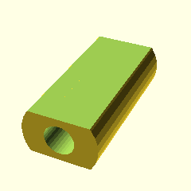</a>

<a href="scads/ubuntu_tag_keyring.scad">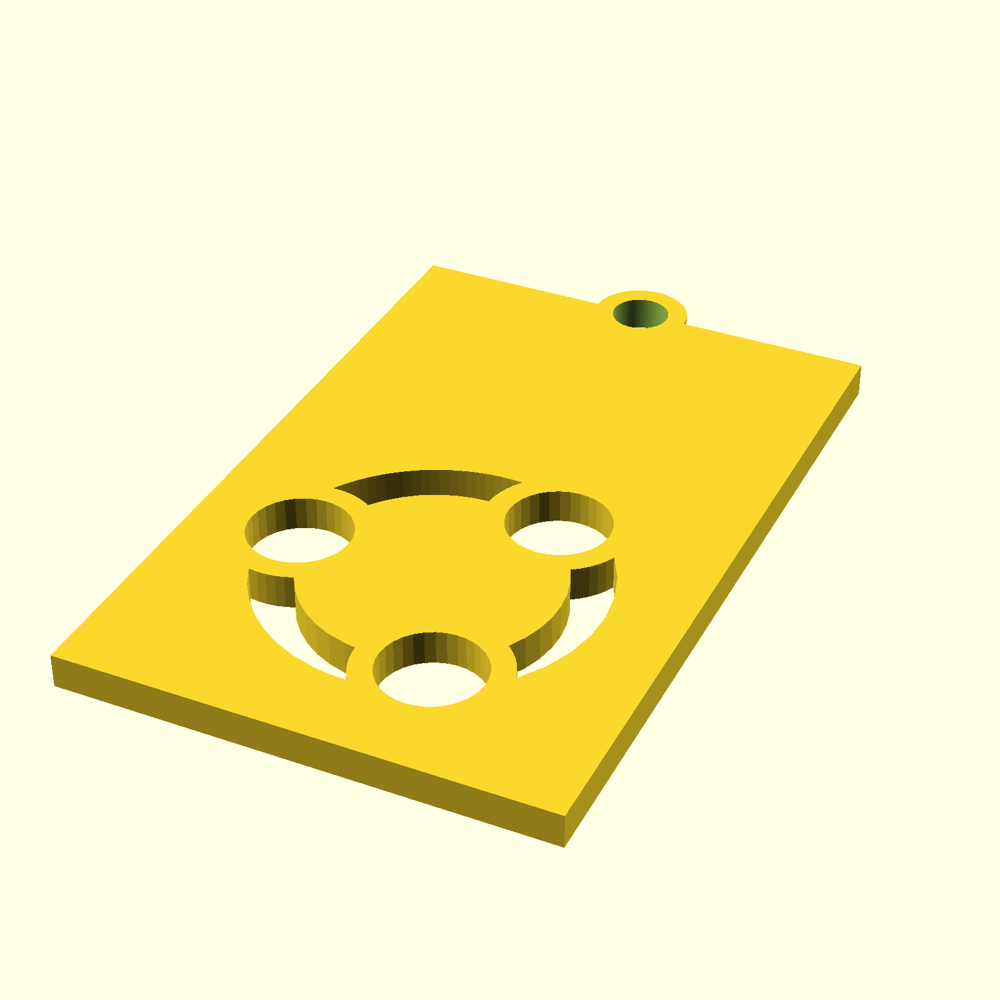</a>
<a href="scads/usbc_adaptor.scad">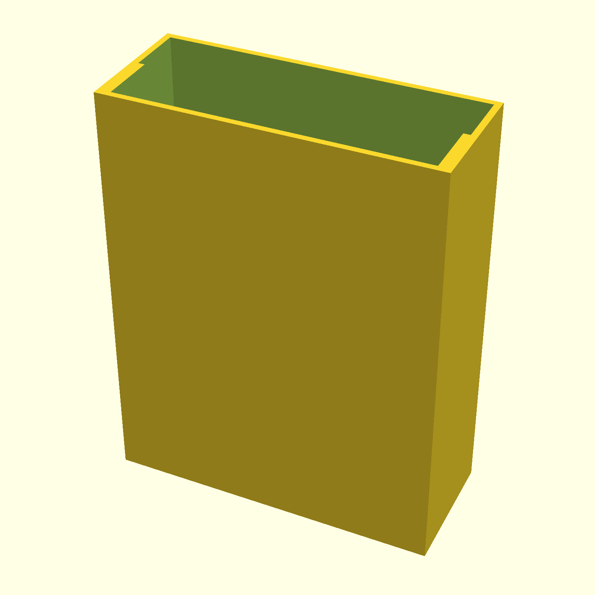</a>
